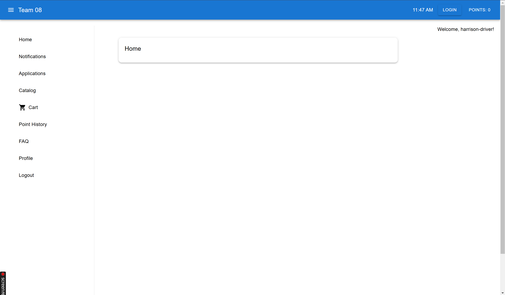
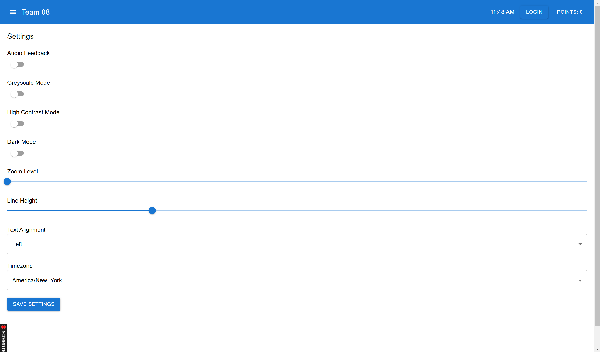
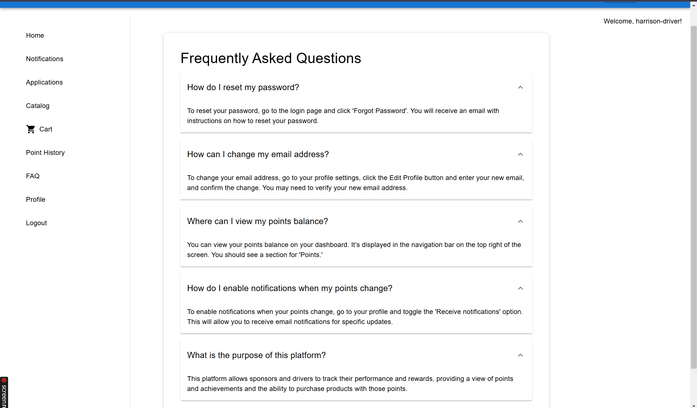
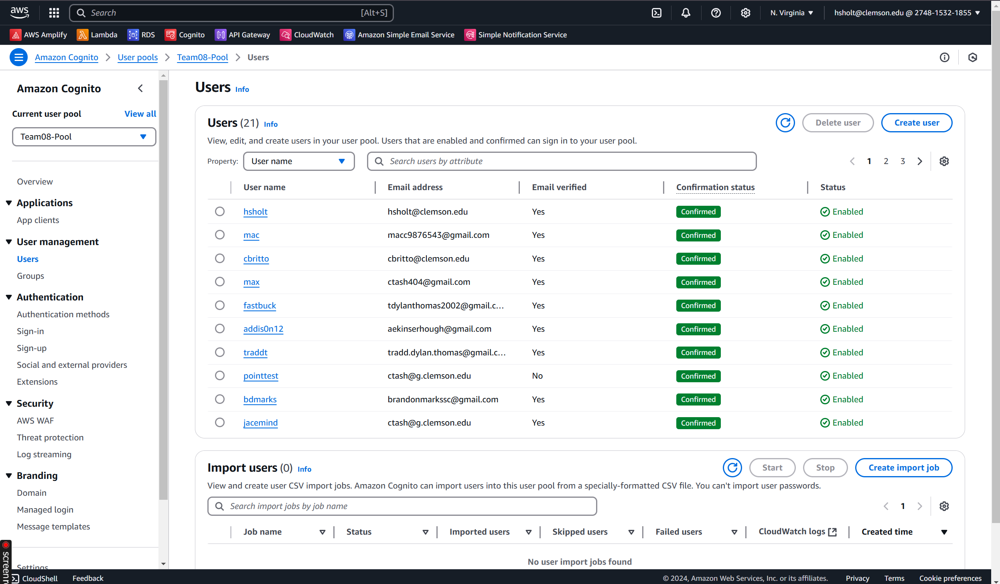
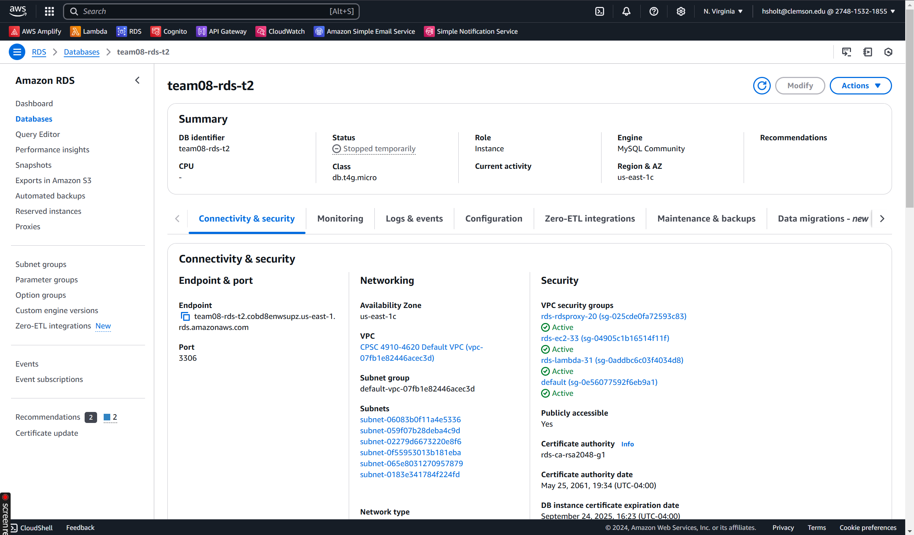
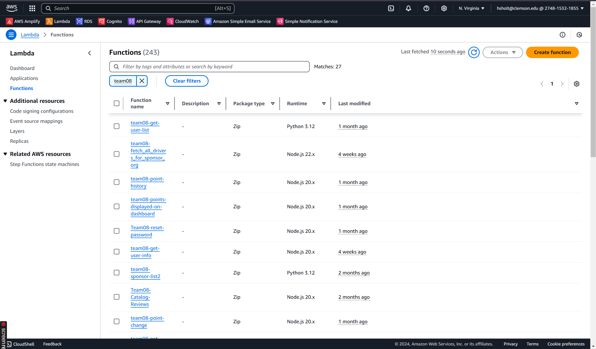
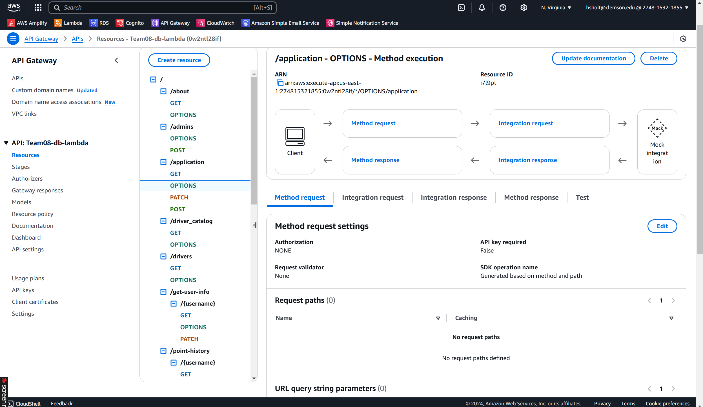

# Good Driver Incentive Program

> **Status**: ✅ Completed & Delivered (Earned an A in CPSC 4910)

The **Good Driver Incentive Program** is a full-stack web application built by a 5-person Agile team over 16 weeks as part of the Senior Computing Practicum at Clemson University. The app encourages safe driving behavior among truck drivers by awarding redeemable points for positive actions.

I served as the **Scrum Master**, leading weekly standups, sprint planning, and retrospectives while actively contributing to the UI and backend features. The project culminated in a class-wide load test with over 70 users.

---

## 📌 Features

### 🚚 Drivers
- View & update profiles
- Track reward points in real-time
- Redeem rewards from a product catalog
- Monitor past orders

### 🧑‍💼 Sponsors
- Manage driver applications & accounts
- Adjust driver points
- Add/edit/remove products from the catalog
- Impersonate drivers for troubleshooting

### 🛡️ Admins
- Full access to all user data
- Security settings & user role management
- Audit logs and system-wide reporting

---

## 🛠️ Tech Stack

| Layer              | Technologies                                                                 |
|-------------------|------------------------------------------------------------------------------|
| **Frontend**       | React, Vite, TypeScript, Material UI                                         |
| **Backend**        | AWS Lambda, Node.js, Amazon API Gateway                                      |
| **Database**       | AWS RDS (MySQL)                                                              |
| **Authentication** | Amazon Cognito                                                              |
| **Email Service**  | AWS SES (Transactional emails for orders)                                   |
| **Hosting & CI/CD**| AWS Amplify                                                                  |
| **Project Mgmt**   | Azure DevOps (1-week sprints, release board)                                 |
| **Testing**        | Postman, AWS CloudWatch                                                      |

---

## 📅 Project Timeline

| Phase              | Timeline                     |
|-------------------|------------------------------|
| Team Formation     | Weeks 1–3                     |
| Agile Development  | Weeks 4–15 (1-week sprints)   |
| Final Demo & QA    | Weeks 16–17                   |

---

## ✅ Accomplishments

- Integrated **AWS SES** for order confirmations
- Built **real-time point update system** via API Gateway & Lambda
- Created fully accessible UI (WCAG AA compliant)
- Developed modular **driver profile** and **order management** flows
- Integrated external product APIs (eBay → iTunes)

---

## ♿ Accessibility Features

- Screen reader support (NVDA, VoiceOver tested)
- Full keyboard navigation
- Dark mode, high contrast, grayscale
- Font size & line height controls
- Audio feedback and text alignment options

---

## 📸 Screenshots

| Feature                        | Preview                            |
|-------------------------------|-------------------------------------|
| Home Page                     |                  |
| Accessibility Settings        |     |
| FAQ Page                      |                    |
| Cognito                       |            |
| RDS                           |                    |
| Lambda                        |              |
| API Gateway                   |            |

> 💡 Feel free to clone this repo.

---

## 🧠 Key Lessons Learned

- How to design and maintain **secure serverless architecture**
- Building fully **accessible, user-friendly** React UIs
- Leading Agile teams and managing **project velocity**
- Integrating AWS services for scalable production-ready solutions

---

## 🗂 Repository Notes

This repository is a **showcase clone** of the original team repository, with personal highlights and contributions. No production data or credentials are stored here.

---

## 📄 License

MIT – For educational and demonstration purposes only.

